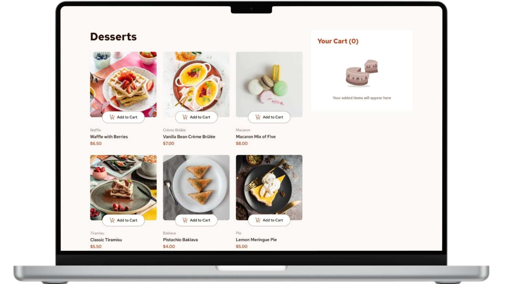

# Product List

<figure>
    
</figure>

## 📝 **Sobre o Projeto**

    Product List é uma página de listagem de produtos focada em usabilidade, responsividade e funcionalidade. Ele foi projetado para proporcionar uma experiência de compra eficiente e intuitiva, desde a navegação até a finalização do pedido. Utiliza tecnologias modernas para atender às demandas de desempenho, acessibilidade e facilidade de uso, sendo ideal para lojas online que buscam oferecer uma experiência de compra agradável e eficiente.

[Demo do Projeto](https://product-list-walacedev.netlify.app/) 

## 🛠️ **Tecnologias Utilizadas**

- **React.js** → Biblioteca JavaScript para construção de interfaces.
- **Vite** → Ferramenta de build rápida para desenvolvimento front-end.
- **Sass:** Para estilização avançada e modular, garantindo um design limpo e personalizável.
_ **ESLint** → Ferramenta para padronização e linting do código JavaScript/JSX.

## 🚀 **Recursos Principais**

- **Adicionar Produtos ao Carrinho:** Permite que o usuário escolha os produtos desejados para compra de forma prática.

- **Gerenciamento de Quantidade:** Opção para aumentar ou diminuir a quantidade de um produto diretamente no carrinho.

- **Remover Produtos do Carrinho:** Facilidade para excluir itens não desejados.

- **Finalização do Pedido:** Após a seleção, o usuário pode confirmar o pedido e concluir a compra.

## 📂 **Estrutura do Projeto**

├── public              # Arquivos públicos (favicons, imagens estáticas, etc.) 
│   ├── assets          # Recursos estáticos (imagens, fontes,etc.) 
│   └── favicon.svg     # Ícone do site 
├── src                 # Código-fonte do projeto 
│   ├── components      # Componentes reutilizáveis 
│   ├── context         # Context API (gerenciamento de estado global) 
│   ├── data            # Dados estáticos ou mocks de API 
│   ├── pages           # Páginas do projeto 
│   ├── sass            # Arquivos Sass organizados 
│   ├── main.jsx        # Arquivo principal da aplicação 
│   └── App.jsx         # Componente raiz 
├── .gitignore          # Arquivos ignorados pelo Git 
├── .gitattributes      # Configurações do Git 
├── index.html          # Estrutura principal da aplicação (carregado pelo Vite) 
├── package.json        # Dependências e scripts do projeto 
├── vite.config.js      # Configurações do Vite 
├── README.md           # Documentação do projeto 
└── LICENSE             # Licença do projeto 

